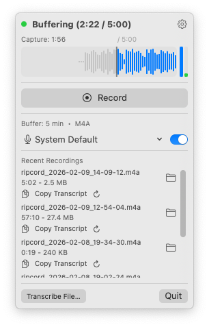

# Ripcord

macOS menubar app for retroactive audio recording with transcription.

<p align="center">
  
</p>

## Features

- **Retroactive circular buffer** — 1–15 min configurable; save audio that already happened
- **System audio + microphone** capture with live mixing
- **Live waveform + level meters** — real-time visualization during buffering and recording
- **Capture duration scrubber** — drag to select how much of the buffer to keep
- **Mic device selection** — choose input device from the menubar
- **WAV and M4A output** with configurable quality
- **Silence auto-pause** — automatically pauses recording during silence
- **Built-in transcription** with speaker diarization (via [FluidAudio](https://github.com/FluidInference/FluidAudio))
- **Transcript formats** — txt, md, json, srt, vtt
- **Filler word removal** — strip um, uh, etc. from transcripts
- **Re-transcribe** — re-process recordings with different settings
- **Transcribe external files** — import and transcribe any audio file
- **Recent recordings** — quick access with copy-transcript and re-transcribe actions
- **`transcribe` CLI** for batch transcription
- **Global hotkey** — Cmd+Shift+R
- **Launch at login** — optional auto-start with macOS

## Install

Download the latest `Ripcord.app` from [Releases](../../releases) and move it to your Applications folder.

**Note:** The app is unsigned. On first launch, macOS will show a warning that it's from an unidentified developer. To bypass this:

```bash
xattr -cr /path/to/Ripcord.app
```

Or right-click the app, select "Open", then click "Open" in the dialog.

### Requirements

- macOS 14.2+ (Sonoma)
- Apple Silicon

### Permissions

On first launch, macOS will prompt for:

- **Screen & System Audio Recording** — required for capturing system audio
- **Microphone** — required for mic input

## Usage

Launch Ripcord from the menubar. It immediately starts filling a circular buffer with system audio (and mic, if enabled).

### Recording

- **Drag the capture scrubber** to choose how much buffered audio to keep (30s up to the full buffer)
- **Click Record** (or press Cmd+Shift+R) to save — the recording includes the selected buffer plus any new audio going forward
- **Click Stop** to finish — the file is saved to the output directory

The **waveform** shows live audio amplitude. During buffering, the highlighted region shows how much audio will be captured; during recording, the entire waveform turns red. The **level meters** on the right show system audio (blue) and microphone (green) levels.

### Microphone

Use the mic dropdown at the bottom of the panel to select an input device, or toggle the mic off entirely. System audio is always captured regardless of mic setting.

### Settings

Click the gear icon to open the settings panel.

**Recording** — set the buffer duration (1–15 min), output format (WAV or M4A), and M4A quality (64–256 kbps). These are locked while recording.

**Silence detection** — enable auto-pause to stop recording during silence. Configure the RMS threshold and how long silence must last before pausing.

**Transcription** — download models (one-time), then configure defaults for auto-transcription:
- Language model: Multilingual (v3) or English-only (v2)
- Transcript format: txt, md, json, srt, vtt
- Remove filler words (um, uh, etc.)
- Speaker attribution (diarization) with sensitivity and expected speaker count

Enable "Transcribe recordings" to automatically transcribe every new recording.

**General** — choose the output directory and enable launch at login.

### Transcription

After recording, your files appear in **Recent recordings** at the bottom of the panel. From there you can:

- **Transcribe** — click to open a config popover where you pick model, format, filler removal, and speaker settings, then transcribe
- **Copy transcript** — copy the full transcript text to the clipboard
- **Re-transcribe** — re-process a recording with different settings

To transcribe an external audio file, click **Transcribe file** at the bottom-left of the panel.

### Transcribe CLI

Bundled inside `Ripcord.app/Contents/MacOS/transcribe`.

```
transcribe <audio-file> [options]
```

| Flag | Description |
|------|-------------|
| `--model` | ASR model version: v2 (English), v3 (multilingual, default) |
| `--format` | Output format: txt, md, json, srt, vtt |
| `-o, --output` | Output file path |
| `--no-diarize` | Skip speaker diarization |
| `--num-speakers` | Exact speaker count hint |
| `--min-speakers` | Minimum speaker count hint |
| `--max-speakers` | Maximum speaker count hint |
| `--sensitivity` | Diarization sensitivity 0.0–1.0 (higher = more speakers) |
| `--speech-threshold` | Speech detection threshold 0.0–1.0 (lower = more sensitive) |
| `--min-segment` | Minimum segment duration in seconds |
| `--min-gap` | Minimum gap duration in seconds |
| `--fast` | Use fast diarization quality (default: balanced) |
| `--remove-fillers` | Remove filler words (um, uh, etc.) |
| `--range` | Time range as start-end (e.g. `5:00-7:30`, `300-450`, `5:00-`) |
| `--force` | Overwrite existing output file |
| `-v, --verbose` | Print performance metrics |

Example:

```
transcribe recording.m4a --format md -o transcript.md --num-speakers 2
```

## Build from Source

Requires Swift 6.0 toolchain (Command Line Tools).

```
git clone https://github.com/unthingable/ripcord.git
cd ripcord
make install      # build, bundle Ripcord.app, copy to ~/Applications
```

### Testing

```
make test                    # unit tests (buffer, writer, interleave)
make test-e2e                # end-to-end (requires audio permissions)
swift run TranscribeKitTests # merge pipeline tests
```

## Project Structure

```
Sources/
  Ripcord/            # menubar app (SwiftUI)
  TranscribeKit/      # transcription library (shared)
  transcribe/         # CLI executable
Tests/
  test_components.swift          # unit tests
  test_e2e.swift                 # end-to-end (requires audio permissions)
  TranscribeKitTests/            # TranscribeKit unit tests
```
