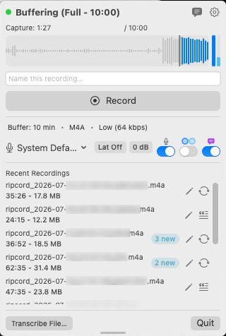

# Ripcord

macOS menubar app for retroactive audio recording with transcription.

<p align="center">
  
</p>

The key idea: Ripcord runs a circular buffer in the background. When something worth keeping happens, you save it — and the audio that already happened is already there.

## Features

### Audio Capture

- **Retroactive circular buffer** — 1–15 min configurable; save audio that already happened
- **System audio + microphone** — mix into one track or split into stereo (system L, mic R) for post-production remixing
- **Mic device selection** — choose any input device from the menubar
- **Silence auto-pause** — automatically pauses recording during silence, with configurable RMS threshold and duration

### Transcription

- **Built-in transcription** with speaker diarization (via [FluidAudio](https://github.com/FluidInference/FluidAudio))
- **Speaker identity persistence** — voice profiles saved across sessions with automatic matching
- **Video file transcription** — transcribe audio from MP4, MOV, AVI, and other video formats
- **Re-transcribe** — re-process any recording with different settings
- **Filler word removal** — strip um, uh, etc. from transcripts
- **Transcript formats** — txt, md, json, srt, vtt

### Live Transcript

- **Real-time streaming transcription** in a dedicated window
- **Remote control socket** — Unix domain socket for external tools to receive live transcript data and control the session
- **Tunable parameters** — adjust diarization sensitivity, speaker count, and display options live

### CLI

- **`transcribe` CLI** for batch transcription — bundled inside the app, usable standalone

## Install

```bash
curl -fsSL https://raw.githubusercontent.com/unthingable/ripcord/main/install.sh | bash
```

This downloads the latest release, installs to `/Applications`, and clears the quarantine attribute.

Or download `Ripcord.app` manually from [Releases](../../releases) and move it to your Applications folder. The app is unsigned, so you'll need to clear quarantine:

```bash
xattr -cr /Applications/Ripcord.app
```

### Requirements

- macOS 14.2+ (Sonoma)
- Apple Silicon

### Permissions

On first launch, macOS will prompt for:

- **Screen & System Audio Recording** — required for capturing system audio
- **Microphone** — required for mic input

## Usage

Launch Ripcord from the menubar. It immediately starts filling a circular buffer with system audio (and mic, if enabled).

### Recording

- **Drag the capture scrubber** to choose how much buffered audio to keep (30s up to the full buffer)
- **Click Record** (or press Cmd+Shift+R) to save — the recording includes the selected buffer plus any new audio going forward
- **Click Stop** to finish — the file is saved to the output directory

The **waveform** shows live audio amplitude. During buffering, the highlighted region shows how much audio will be captured; during recording, the entire waveform turns red. The **level meters** on the right show two bars — blue for system audio, cyan for mic.

### Transcription

After recording, your files appear in **Recent recordings** at the bottom of the panel. From there you can:

- **Transcribe** — pick model, format, and speaker settings, then transcribe
- **Copy transcript** — copy the full transcript to the clipboard
- **Re-transcribe** — re-process with different settings

To transcribe an external audio or video file, click **Transcribe file** at the bottom-left of the panel. Model downloads are one-time and happen through Settings.

### Transcribe CLI

Bundled inside `Ripcord.app/Contents/MacOS/transcribe`.

```
transcribe <audio-file> [options]
```

| Flag | Description |
|------|-------------|
| `--model` | ASR model version: v2 (English), v3 (multilingual, default) |
| `--format` | Output format: txt, md, json, srt, vtt |
| `-o, --output` | Output file path |
| `--no-diarize` | Skip speaker diarization |
| `--num-speakers` | Exact speaker count hint |
| `--min-speakers` | Minimum speaker count hint |
| `--max-speakers` | Maximum speaker count hint |
| `--sensitivity` | Diarization sensitivity 0.0–1.0 (higher = more speakers) |
| `--speech-threshold` | Speech detection threshold 0.0–1.0 (lower = more sensitive) |
| `--min-segment` | Minimum segment duration in seconds |
| `--min-gap` | Minimum gap duration in seconds |
| `--fast` | Use fast diarization quality (default: balanced) |
| `--remove-fillers` | Remove filler words (um, uh, etc.) |
| `--range` | Time range as start-end (e.g. `5:00-7:30`, `300-450`, `5:00-`) |
| `--force` | Overwrite existing output file |
| `-v, --verbose` | Print performance metrics |

Example:

```
transcribe recording.m4a --format md -o transcript.md --num-speakers 2
```

## Build from Source

Requires Swift 6.0 toolchain (Command Line Tools).

```
git clone https://github.com/unthingable/ripcord.git
cd ripcord
make install      # build, bundle Ripcord.app, copy to ~/Applications
```

### Testing

```
make test                    # unit tests (buffer, writer, interleave)
make test-e2e                # end-to-end (requires audio permissions)
swift run TranscribeKitTests # merge pipeline tests
```

## Project Structure

```
Sources/
  Ripcord/            # menubar app (SwiftUI)
  TranscribeKit/      # transcription library (shared)
  transcribe/         # CLI executable
Tests/
  test_components.swift          # unit tests
  test_e2e.swift                 # end-to-end (requires audio permissions)
  TranscribeKitTests/            # TranscribeKit unit tests
```
